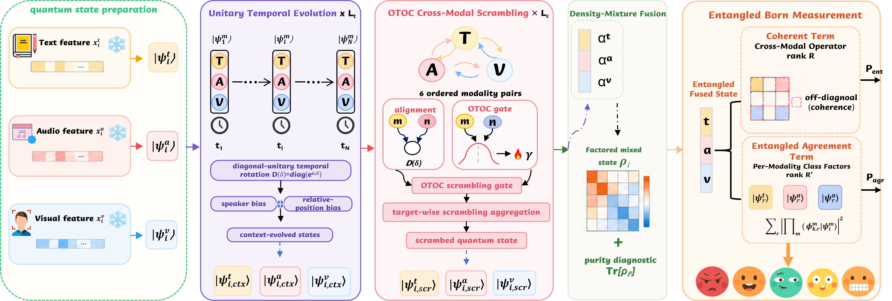

# QESM

<p align="right">
  <strong>English</strong> | <a href="README_zh.md">简体中文</a>
</p>

**A Quantum-Inspired Network with Dynamic Fusion and Entangled Measurement for Multimodal Emotion Recognition**

[](https://github.com/QESM-MERC/Quantum_qesm)
[](https://pytorch.org/)
[](https://github.com/QESM-MERC/Quantum_qesm/actions/workflows/ci.yml)

> [!IMPORTANT]
> This initial release publishes the project overview first. Source code are being prepared for the subsequent release.

QESM is a classical PyTorch model inspired by quantum mathematical structures; it does not require quantum hardware. It represents text, audio, and visual utterance features as complex states, evolves them over dialogue context, models cross-modal perturbations, and performs a joint emotion measurement.



## Architecture

The processing order used in the experiments is:

```text
Quantum State Preparation -> UTE_1 -> OCS -> UTE_2 -> Density-Mixture Fusion -> EBM
```

- **Unitary Temporal Evolution (UTE)** propagates speaker-aware context through norm-preserving phase evolution.
- **OTOC Cross-Modal Scrambling (OCS)** models dynamic cross-modal complementarity through an out-of-time-order-correlator-inspired interaction.
- **Entangled Born Measurement (EBM)** combines cross-modal phase coherence with trimodal class agreement for emotion classification.

## Results

QESM is evaluated with weighted F1 (WF1) on IEMOCAP and MELD.

| Dataset | Utterances | Classes | Representative WF1 | Five-run WF1 |
|---|---:|---:|---:|---:|
| IEMOCAP | 7,433 | 6 | **73.23** | **72.82 ± 0.23** |
| MELD | 13,708 | 7 | **67.31** | **67.17 ± 0.11** |

The five-run statistics use seeds `{0, 1, 2, 3, 4 }` and report the sample standard deviation. Exact configuration snapshots will be added before publication.

## Repository layout

```text
qotoc/          Core complex-valued QESM modules and model
configs/        Versioned JSON examples for the training CLI
dataset.py      IEMOCAP/MELD feature loading and split construction
train.py        Training and evaluation entry point
evaluate.py     Raw checkpoint inference entry point
tests/          Numerical and model-integration tests
```

The internal Python package retains the historical `qotoc` name. A checkpoint must still match
the saved architecture, preprocessing protocol, and feature dimensions; inference validates these
requirements strictly.

## Installation

Python 3.10 or newer is recommended.

```bash
python -m venv .venv
# Linux/macOS: source .venv/bin/activate
# Windows PowerShell: .venv\Scripts\Activate.ps1
python -m pip install --upgrade pip
python -m pip install -r requirements.txt
```

## Data preparation

The default path reads the original combined feature pickle directly. No converted
M3Net files or replacement embeddings are needed:

```text
data/
├── iemocap_multimodal_features.pkl
└── meld_multimodal_features.pkl
```

## Training

Explicit command-line options override values loaded from `--config`. The checked-in JSON files are runnable examples, not yet the frozen configurations behind the headline table.

## Tests

```bash
python -m pytest -q
```

## Citation

The manuscript is proof. Publication metadata and a BibTeX entry will be added when available. Until then, please link to:


## License

